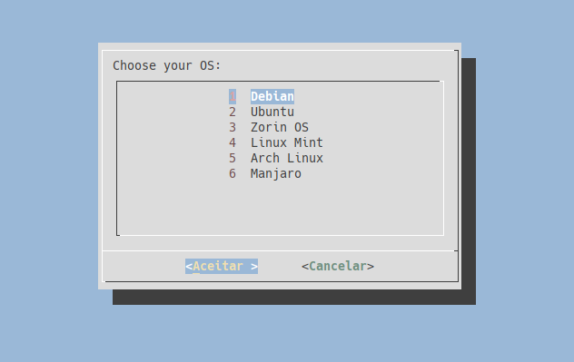

___

<p align="center">
	
</p>

___

<p align="center">
	<h3 align="center">Kali my Linux</h3>
</p>

<p align="center">
	<a target="__blank" href="#">
	  
	  
	</a>
</p>

___

<br>

### You can use on

- Debian
- Ubuntu
- Zorin OS
- Linux Mint
- Arch Linux
- Manjaro


<br>

___

<br>

### How to install

- Copy this command and run on your terminal.

```shell
git clone https://github.com/i386angel/kali-my-linux && cd kali-my-linu && sudo chmod +x kml.sh
```

<br>

___

<br>

### How to use

```shell
sudo ./kml.sh
```

<br>

___


<br>

### Examples

<br>

#### Start Script


#### Choose OS




#### Select Category


<br>

___
